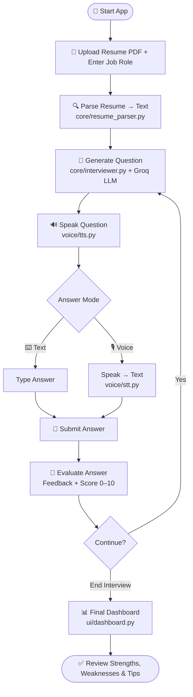
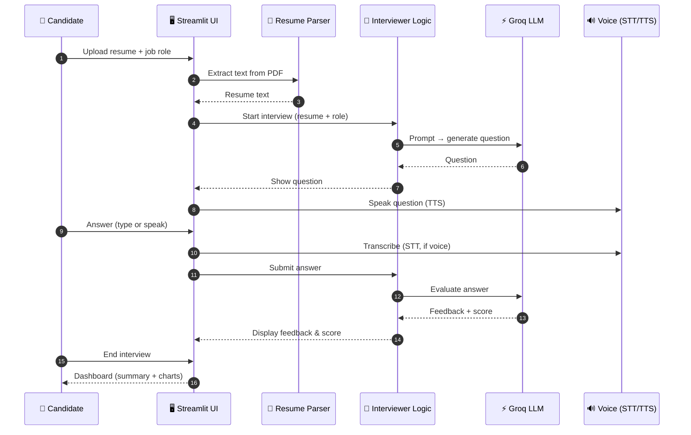
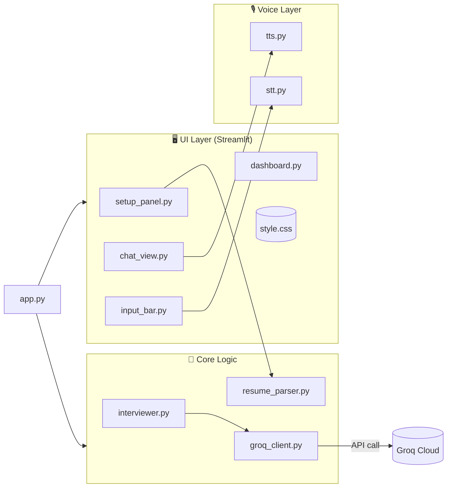

<div align="center">

<!-- Replace with your own banner: assets/screenshots/banner.png -->


# 🎤 AI Live Interviewer

### Resume-aware, voice-enabled mock interviews powered by Generative AI

[](https://www.python.org/)
[](https://streamlit.io/)
[](https://groq.com/)
[](#-voice-support)
[](#-license)
[](#-contributing)

[Demo](#-demo) • [Features](#-features) • [How It Works](#-how-it-works) • [Project Structure](#-project-structure) • [Installation](#-installation) • [Usage](#-usage) • [Roadmap](#-roadmap)

</div>

---

## 📖 Overview

**AI Live Interviewer** is a **Streamlit-based web app** that simulates a real-time technical interview. Upload your resume, choose a job role, and an AI interviewer (powered by the **Groq API**) asks tailored technical and behavioral questions, evaluates each answer, gives instant feedback and a score, and finishes with a full **performance dashboard**.

> 💡 Practice interviews the way they actually happen, with questions based on **your own resume**, and answer by **typing or speaking**.

---

## 🎬 Demo

<div align="center">

<!-- Add your demo GIF: assets/screenshots/demo.gif -->


</div>

---

## 🖼️ Screenshots

| 1️⃣ Setup Panel | 2️⃣ Interview Chat |
|:---:|:---:|
|  |  |
| Upload resume & enter job role | Questions, answers, feedback & score |

| 3️⃣ Voice Input | 4️⃣ Final Dashboard |
|:---:|:---:|
|  |  |
| Answer with your microphone | Scores, strengths, weaknesses & charts |

> 📌 **Tip:** Create a folder `assets/screenshots/` and drop your screenshots there using the filenames above.

---

## ⚡ Features

| Category | Details |
|---|---|
| 📄 **Resume Parsing** | Upload a PDF resume; text is extracted with PyPDF and used to personalize questions |
| 🎯 **Role-Based Questions** | Enter a job role (e.g., *Data Analyst*, *Backend Developer*) for relevant technical + behavioral questions |
| 🤖 **Dynamic AI Interviewer** | Questions are generated live by a Groq-hosted LLM and adapt to the conversation |
| 💬 **Chat-Style UI** | Interviewer questions on the left, candidate answers on the right |
| 📝 **Instant Feedback** | Every answer receives feedback and a score right away |
| 🔊 **Text-to-Speech** | The interviewer reads questions aloud (`pyttsx3`) |
| 🎙️ **Speech-to-Text** | Answer using your microphone (`SpeechRecognition`) |
| 📊 **Summary Dashboard** | Question-by-question review, overall score out of 10, strengths, weaknesses, improvement tips & score charts |
| 🎨 **Custom Styling** | Clean look with custom CSS in `assets/style.css` |
| 🧠 **Session Memory** | Answers, scores and feedback are stored in Streamlit session state |

---

## 🔄 How It Works

### High-Level Flow



### Interaction Sequence



### Architecture



---

## 📂 Project Structure

```
ai_live_interviewer/
│
├── app.py                    # 🚪 Main Streamlit entry point
├── .env                      # 🔑 Groq API key (not committed)
├── requirements.txt          # 📦 Python dependencies
├── README.md                 # 📘 Project documentation
│
├── core/                     # 🧠 Business logic
│   ├── groq_client.py        #    Groq LLM wrapper
│   ├── interviewer.py        #    Question generation + scoring logic
│   └── resume_parser.py      #    Resume PDF → text
│
├── voice/                    # 🎙️ Voice features
│   ├── stt.py                #    Speech → Text
│   └── tts.py                #    Text → Speech
│
├── ui/                       # 🖥️ Interface components
│   ├── setup_panel.py        #    Resume & role upload UI
│   ├── chat_view.py          #    Chat interface
│   ├── input_bar.py          #    Answer bar + mic + submit + end buttons
│   └── dashboard.py          #    Final summary & analytics
│
└── assets/
    ├── style.css             # 🎨 Custom CSS styling
    └── screenshots/          # 🖼️ README images (add yours here)
```

### 📁 Module Reference

| File | Responsibility |
|---|---|
| `app.py` | Wires everything together: page config, session state, routing between setup → interview → dashboard |
| `core/groq_client.py` | Reads `GROQ_API_KEY` and sends chat-completion requests to Groq |
| `core/interviewer.py` | Builds prompts, generates questions, evaluates answers, and produces the final summary |
| `core/resume_parser.py` | Extracts text from the uploaded PDF using PyPDF |
| `voice/stt.py` | Captures microphone audio and converts it to text |
| `voice/tts.py` | Reads interviewer questions aloud |
| `ui/setup_panel.py` | Resume uploader and job-role input |
| `ui/chat_view.py` | Renders the conversation with feedback and scores |
| `ui/input_bar.py` | Text box, 🎙️ mic, Submit and End Interview buttons |
| `ui/dashboard.py` | Final report: per-question table, overall score, strengths/weaknesses, charts |
| `assets/style.css` | Custom look and feel |

---

## 🛠 Tech Stack

| Layer | Technology |
|---|---|
| **Frontend / App** | [Streamlit](https://streamlit.io/) |
| **LLM** | [Groq API](https://groq.com/) |
| **Resume Parsing** | [PyPDF](https://pypi.org/project/pypdf/) |
| **Speech-to-Text** | [SpeechRecognition](https://pypi.org/project/SpeechRecognition/) |
| **Text-to-Speech** | [pyttsx3](https://pypi.org/project/pyttsx3/) |
| **Config** | [python-dotenv](https://pypi.org/project/python-dotenv/) |
| **Styling** | Custom CSS |
| **Languages** | Python (~96%) · CSS (~4%) |

---

## 🛠 Installation

### Prerequisites

- Python **3.9+**
- A free **[Groq API key](https://console.groq.com/)**
- A working **microphone** (optional, for voice answers)

### Steps

**1️⃣ Clone the repository**

```bash
git clone https://github.com/itsNIVESHTEJA/AI-Interviewer-Resume-Parser.git
cd AI-Interviewer-Resume-Parser
```

**2️⃣ Create a virtual environment (recommended)**

```bash
python -m venv venv

# Linux / macOS
source venv/bin/activate

# Windows
venv\Scripts\activate
```

**3️⃣ Install dependencies**

```bash
pip install -r requirements.txt
```

**4️⃣ Configure environment variables**

Create a `.env` file in the project root:

```env
GROQ_API_KEY=your_groq_api_key_here
```

> ⚠️ Never commit your `.env` file. It is already covered by `.gitignore`.

---

## 🚀 Usage

```bash
streamlit run app.py
```

Then open **http://localhost:8501** in your browser.

### Step-by-Step

1. 📄 **Upload** your resume (PDF) and enter the **job role**.
2. ▶️ **Start** the interview.
3. 🔊 **Listen** to (or read) the question.
4. ⌨️ **Type** or 🎙️ **speak** your answer, then **Submit**.
5. 📝 Review the instant **feedback and score**.
6. 🔁 Continue until you're done, then click **End Interview**.
7. 📊 Explore the **final dashboard**.

---

## 📊 Final Dashboard

The summary dashboard gives you:

- ✅ Question-by-question answers, feedback and scores
- ⭐ **Overall performance** (out of 10)
- 💪 **Strengths**
- ⚠️ **Weaknesses**
- 🛤️ **Improvement suggestions**
- 📈 **Visual charts** of your scores

<div align="center">

</div>

---

## 🎙️ Voice Support

| Feature | Library | Notes |
|---|---|---|
| Text-to-Speech | `pyttsx3` | Works offline; uses system voices |
| Speech-to-Text | `SpeechRecognition` | Needs microphone access; some engines need internet |

> On some systems you may also need `PyAudio` for microphone input:
> ```bash
> pip install pyaudio
> ```

---

## ⚙️ Customization

| Want to change… | Edit |
|---|---|
| Question style / difficulty | `core/interviewer.py` |
| Scoring rubric | `core/interviewer.py` |
| LLM model or parameters | `core/groq_client.py` |
| Look & feel | `assets/style.css` |
| Voice speed / language | `voice/tts.py`, `voice/stt.py` |

---

## 🧯 Troubleshooting

| Problem | Fix |
|---|---|
| `GROQ_API_KEY not found` | Check that `.env` is in the project root and the key name is exact |
| Microphone not detected | Allow mic permission in your OS/browser and install `PyAudio` |
| No speech output | Verify system audio and that `pyttsx3` has a voice installed |
| Empty resume text | The PDF may be scanned (image-only); use a text-based PDF |
| `ModuleNotFoundError` | Activate your virtual env and re-run `pip install -r requirements.txt` |

---

## 🗺️ Roadmap

- [x] Resume PDF parsing
- [x] AI-generated questions and scoring
- [x] Voice input / output
- [x] Final summary dashboard
- [ ] Support for DOCX resumes
- [ ] Difficulty levels (Beginner / Intermediate / Advanced)
- [ ] Export report as PDF
- [ ] Interview history and progress tracking
- [ ] Multi-language interviews
- [ ] Docker and cloud deployment

---

## 🤝 Contributing

Contributions are welcome!

1. Fork the repo
2. Create a branch: `git checkout -b feature/amazing-feature`
3. Commit: `git commit -m "Add amazing feature"`
4. Push: `git push origin feature/amazing-feature`
5. Open a Pull Request

---

## 📄 License

This project is licensed under the **MIT License**. Add a `LICENSE` file to the repo to make this official.

---

## 👤 Author

**Nivesh Teja**
🔗 GitHub: [@itsNIVESHTEJA](https://github.com/itsNIVESHTEJA)

---

<div align="center">

⭐ **If you found this project helpful, please give it a star!** ⭐

Made with ❤️ using Python, Streamlit & Groq

</div>
